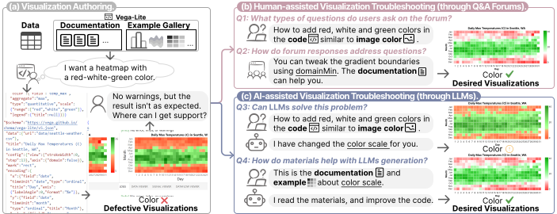
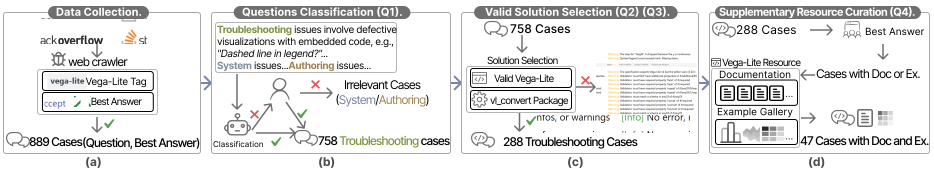

 <h1 align="center">VisTroubleshooting: Ask Humans or AI? Exploring Their Roles in Visualization Troubleshooting</h1>

<p align="center">

</p>

## 📖Overview

Visualization authoring often requires troubleshooting support due to its complex parameter adjustments. This paper investigates two approaches for visualization troubleshooting:
1. **Human-assisted** support via forums like Stack Overflow
2. **AI-assisted** support using Large Language Models (LLMs)
   
Through analyzing 889 Vega-Lite cases from Stack Overflow, we explore the effectiveness of both approaches.

Our findings reveal that human-assisted troubleshooting provides context-sensitive but variable-quality advice, while AI-assisted troubleshooting offers rapid feedback but often requires additional contextual resources for optimal results.


## 🎉News
- [2024-12-07] We open-source our code.

## 🎯Dataset Curation
<p align="center">

</p>

1. **Data Collection**
   - Crawled 889 Vega-Lite related cases from Stack Overflow
   - Each case contains question description and its best answer

2. **Data Processing**
   - Filtered 758 troubleshooting-related cases (Q1)
   - Validated and extracted 288 cases with valid answer codes (Q2, Q3)
   - Enhanced 47 cases with documentation and examples (Q4)

## 📁dataset
All datasets are available in the `dataset/` directory:
- `1_All_cases/`: Original 889 Stack Overflow cases
- `2_Troubleshooting_cases/`: 758 troubleshooting-related cases
- `3_validCode_cases/`: 288 cases with valid answer codes
- `4_DocEx_cases/`: 47 cases with documentation and examples
## 🧪Experiment
### Q1: What types of questions do users ask on the forum?
- `Code/`: Question classification related code
  - `Generate_Question.py`: Generate question classifications
- `Output/`: Classification results

### Q2: How do forum responses address questions?
- `Operation_classfication/`
  - `Code/`: Operation classification related code
  - `Output/`: Classification results
  - `categories.json`: Operation category definitions
- `Code_complexity/`
  - `Code/`: Code complexity related code
  - `Output/`: Code complexity results
  
### Q3: Can LLMs solve this problem?
- `experiement/`: Experiment related code
  - `L0_experiement.py`: Level 0 experiment code
- `output/`: Experiment results
  - `L0_solutions.json`: Level 0 experiment results
  - `L0_solutions_visualization`: The visualization of Level 0 experiment results
  - `evaluation_analysis.xlsx`: Human evaluation results

### Q4:  How do materials help with LLMs generation?
- `experiement/`: Experiment code
  - `L1_experiement_document.py`: Level 1 document experiment
  - `L1_experiement_example.py`: Level 1 example experiment
  - `L1_experiement_prec_document.py`: Level 1 precise document experiment
  - `L1_experiement_prec_example.py`: Level 1 precise example experiment
  - `L2_experiement_document_example.py`: Level 2 document and example experiment
- `results/`: Experiment results
  - `generated_answers_level_1_document.json`: Level 1 document experiment results
  - `generated_answers_level_1_example.json`: Level 1 example experiment results
  - `generated_answers_level_1_prec_document.json`: Level 1 precise document experiment results
  - `generated_answers_level_1_prec_example.json`: Level 1 precise example experiment results
  - `generated_answers_level_2_document_example.json`: Level 2 document and example experiment results
  - `level_pic/`: The visualization of several experiment results
  - `Ans_label.xlsx`: Human evaluation results

### Execution Code
- `execute_PNG_Code/`: Visualization result generation code
  - `direct_execute_Vega_PNG.py`: Generate PNG images from Vega-lite
  - `execute_Vega_PNG_json.py`: Generate PNG images from Vega-lite In JSON
  - `execute_Vega_PNG_xlsx.py`: Generate PNG images from Vega-lite In Excel

## ⚙️Environment Setup

1. Python version
```bash
Python 3.9.17
```

2. Install dependencies
```bash
pip install -r requirements.txt
```

3. Configure environment variables
Create a `.env` file in the root directory:
```bash
OPENAI_API_KEY="your-api-key-here"
OPENAI_BASE_URL="your-base-url-here"
```

## 🚀Usage

1. Run Question Classification Analysis:

```python
python Q1/Code/Generate_Question.py
```

2. Run Operation Classification Analysis:
```python
python Q2/Operation_classfication/Code/Generate_Operation.py
```

3. Run L0_Experiments:
```python
python Q3/experiement/L0_experiement.py
```
4. Run L1_L2_Experiments:

```python
python Q4/experiement/L1_experiement_document.py
python Q4/experiement/L1_experiement_example.py
python Q4/experiement/L1_experiement_prec_document.py
python Q4/experiement/L1_experiement_prec_example.py
python Q4/experiement/L2_experiement_document_example.py
```

5. Generate Visualization Results:

```python
python execute_PNG_Code/direct_execute_Vega_PNG.py
```

